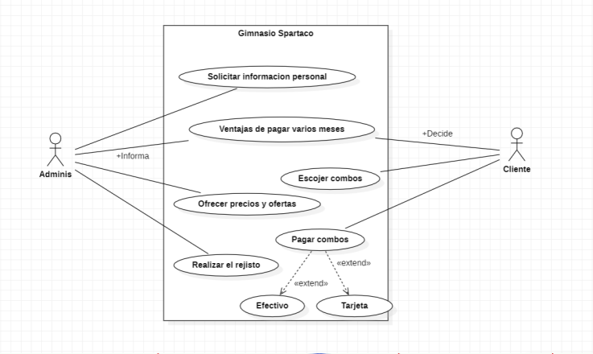

# GIMNASIO

Este código es un programa de consola que calcula el costo de una suscripción en un gimnasio llamado "GYM SPARTACO", teniendo en cuenta el número de meses que se va a suscribir el cliente y su edad para aplicar descuentos si corresponde.

El programa comienza mostrando un mensaje de bienvenida y los valores de referencia para el costo de un mes de suscripción y los porcentajes de descuento para diferentes rangos de tiempo.

Luego, el programa solicita al usuario que ingrese su nombre, edad y el número de meses que desea suscribirse.

El programa crea un objeto "Cliente" que contiene la información ingresada por el usuario.

El programa calcula el costo total de la suscripción sin descuento, y luego aplica un descuento dependiendo del número de meses que el usuario haya ingresado. Si el cliente se suscribe por entre 4 y 6 meses, se aplica un descuento del 10%; si se suscribe por entre 7 y 9 meses, se aplica un descuento del 20%; y si se suscribe por 10 meses o más, se aplica un descuento del 30%.

El programa muestra el nombre, edad y número de meses de suscripción ingresados por el usuario, el costo total sin descuento, y el costo total con el descuento aplicado, si corresponde.

Finalmente, el programa muestra un mensaje de bienvenida al usuario.

Para ejecutar este programa, se puede compilar el archivo "Programa.java" y luego ejecutar el archivo "Programa.class" generado.

Cabe destacar que se requiere un ambiente de desarrollo Java instalado en la máquina para poder compilar y ejecutar el código.

## Demo

    1. Al ejecutar el programa, aparece un mensaje de bienvenida, los valores de referencia para el costo de un mes de suscripción y los porcentajes de descuento para diferentes rangos de tiempo.

    2. Juan lee la información y nota que el valor de un mes de suscripción es de $50,000. También nota que para una suscripción de entre 7 y 9 meses, se aplica un descuento del 20%.

    3. El programa solicita al usuario que ingrese su nombre, edad y el número de meses que desea suscribirse.

    4. Juan escribe su nombre "Juan", su edad "28" y el número de meses que desea suscribirse "8".

    5. El programa calcula el costo total de la suscripción sin descuento. El cálculo sería: $50,000 * 8 = $400,000.

    6. Luego, el programa calcula el descuento a aplicar. Como Juan se suscribe por 8 meses, se aplica un descuento del 20%. El cálculo sería: $400,000 * 0.2 = $80,000.

    7. El programa calcula el costo total con descuento. El cálculo sería: $400,000 - $80,000 = $320,000.

    8. Finalmente, el programa muestra el nombre, edad y número de meses de suscripción ingresados por Juan, el costo total sin descuento ($400,000) y el costo total con descuento ($320,000).

    9. Juan se da cuenta de que el costo total de su suscripción con descuento es de $320,000, y decide que ese es un precio razonable. Él paga su suscripción y comienza a disfrutar del GYM SPARTACO.

    10. El programa muestra un mensaje de bienvenida a Juan, deseándole que disfrute de su estancia en el GYM SPARTACO.

## Uso de jira

## Modelo de uso 

## Diagrama de flujo

